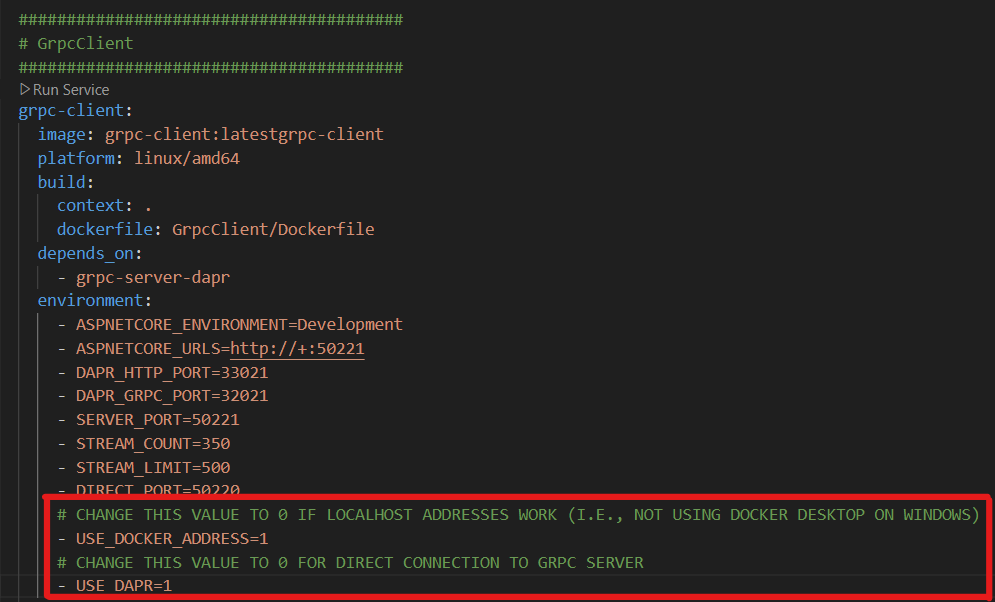

# dapr-streaming-repro
This is an extremely simple reproduction of gRPC concurrent connection behavior in dap vs. vanilla ASP.NET communications.  After cloning the repository, you can run the client code with connections established through dapr sidecars or using direct gRPC communication between ASP.NET client and server services.

The two variables in the following screenshot can be adjusted in <code>docker-compose.yml</code> to switch use cases or adjust the environment for proper addressing.  For Windows-based Docker Destkop installations, the <code>localhost</code> addressing may not work consistently, and the <code>USE_DOCKER_ADDRESS</code> should be set to 1.  Otherwise, set to 0.  Use case switching is accomplished by changing <code>USE_DAPR</code> from 1 (dapr-based) to 0 (ASP.NET native).

Default configuration is to use Windows-based (<code>kubernetes.internal.docker</code>) addressing for non-dapr use cases and to use the dapr-based communication ports.

To run the dapr-based use case:

* Set the <code>USE_DAPR</code> variable in <code>docker-compose.yml</code> to 1
* Run <code>docker-compose up -d</code>

To run the ASP.NET use case:

* Set the <code>USE_DAPR</code> variable in <code>docker-compose.yml</code> to 0
* Run <code>docker-compose up -d</code>

# Results
View the concurrent connection management behavior either in the client or server logs. <code>grpc-server</code> logs will indicate how many concurrent streams are being served.  The code in <code>grpc-client</code> will also echo the total stream count from the server.

In the dapr-based communication, the concurrent streams are capped at 100, which is the limit of a single HTTP2 connection.  Sidecars are expected to open new HTTP2 connections when the concurrent stream limit is reached, but this does not seem to be occurring.  The expected behavior is seen in the ASP.NET use case, where the (adjustable) total of 350 concurrent streams is successfully opened and maintained.